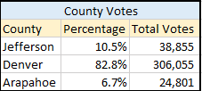

# Election_Analysis

## Project Overview

This project is to audit a local election in US by doing the following tasks.

- Calculate the total votes cast for the election
- Calculate and print the total number of votes for each candidate and the percentage 
- Calculate and print the total of votes for each county and the percentage
- Print the winnerof the election and the county based on popular votes

## Election_Audit Results:
- The total number of votes were : 369,711
- There were a total of 3 counties for this count. 
 
  
