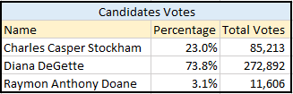
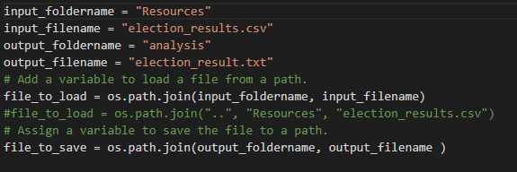
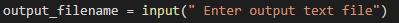

# Election_Analysis

## Project Overview

This project is to audit a local election in US by doing the following tasks.

- Calculate the total votes cast for the election
- Calculate and print the total number of votes for each candidate and the percentage 
- Calculate and print the total of votes for each county and the percentage
- Print the winnerof the election and the county based on popular votes

## Election_Audit Results:
- The total number of votes were : 369,711
- There were a total of 3 counties for this count. 

     
  
- The county with the most popular votes was : Denver
- This were a total of three candidates received voted for this election.

    
    
- The winning candidate was Diana DeGette

## Election-Audit Summary :

We can modify the code to pass the file names and folders as variables to open files for read and write.
Below is the modified code.

We can also go further by accepting the output file by getting it from the user

We can also add the winning county percentage and total votes to display.(The codes are identified as comments)

